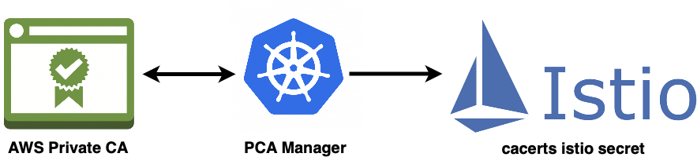

# Overview

This solution helps to get CA certificate from AWS PCA and create custom secret for Istio.

*Pay attention:*
- Istio secret name is [cacerts](https://github.com/tetratelabs/getmesh/blob/cb1aa915ddbf28e1e8a396dbc7570d950313af40/internal/cacerts/k8s/secret.go#L36)
- This `cacerts` secret should be created before installing Istio OR after creation simply restart all Istio pods.
